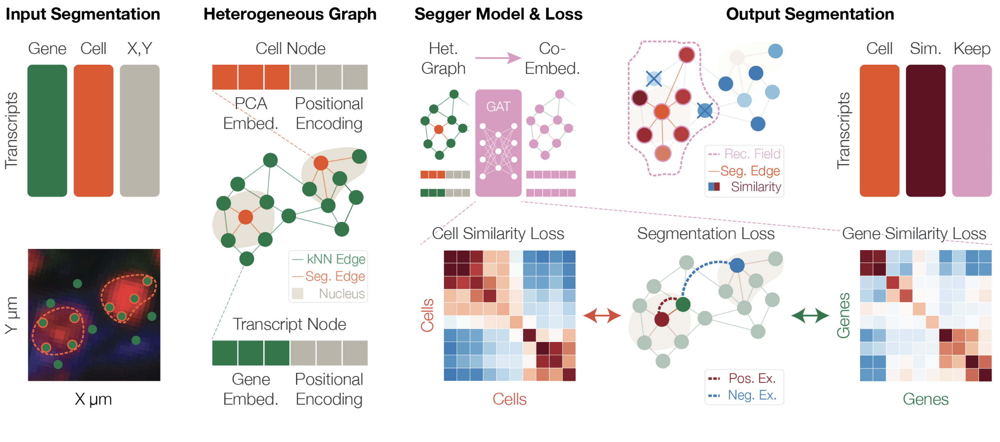

# segger

GNN-based cell segmentation of spatial transcriptomics data.



> The accurate assignment of transcripts to their cells of origin remains the Achilles heel of imaging-based spatial transcriptomics, despite being critical for nearly all downstream analyses. We introduce segger, a versatile graph neural network based on a heterogeneous graph representation of individual transcripts and cells, that frames cell segmentation as a transcript-to-cell link prediction task and can leverage single-cell RNA-seq information to improve transcript assignments. On multiple Xenium dataset benchmarks, segger exhibits superior sensitivity and specificity, while requiring orders of magnitude less compute time than existing methods.
>
> — [Heidari, Moorman, et al. (2025)](https://www.biorxiv.org/content/10.1101/2025.03.14.643160v1)

Full documentation - installation, quickstart, outputs, API reference, etc.:
[segger-segmentation.readthedocs.io](https://segger-segmentation.readthedocs.io/en/latest/)

## Installation

**segger** requires CUDA 13 and Python 3.13. `cuspa` is built from source, so a CUDA compiler (`nvcc`) must be on `PATH`.

Clone the repo, then use `conda` or `pixi` — both install `cuda-nvcc` for you:

```bash
git clone https://github.com/dpeerlab/segger.git && cd segger
```

```bash
# conda
conda env create -n segger -f environment.yml
conda activate segger

# pixi
pixi install
pixi shell
```

Alternatively, if you already have a CUDA 13 `nvcc` on `PATH`, install directly from GitHub without cloning:

```bash
pip install --extra-index-url https://pypi.nvidia.com --extra-index-url https://download.pytorch.org/whl/cu130 git+https://github.com/dpeerlab/segger.git
```

## Usage

```bash
# run segger segmentation
segger segment \
  -i /path/to/your/ist/data/ \
  -o /path/to/save/outputs/

# export different data formats (e.g. boundaries, spatialdata, anndata, xeniumranger, ...)
segger export boundaries \
  -s /path/to/save/outputs/segger_segmentation.parquet \
  -o /path/to/export/
```

See [notebooks/quickstart.ipynb](notebooks/quickstart.ipynb) for an end-to-end walkthrough.

## Contributing

See [CONTRIBUTING.md](CONTRIBUTING.md).

## Preprint

[Heidari, E., Moorman, A., et al. Segger: Fast and accurate cell segmentation of imaging-based spatial transcriptomics data. *bioRxiv* (2025).](https://www.biorxiv.org/content/10.1101/2025.03.14.643160v1.full.pdf)

## Citation

If you use segger in your research, please cite:

```bibtex
@article{heidari2025segger,
  title={Segger: Fast and accurate cell segmentation of imaging-based spatial transcriptomics data},
  author={Heidari, Elyas and Moorman, Andrew and others},
  journal={bioRxiv},
  year={2025},
  doi={10.1101/2025.03.14.643160}
}
```
